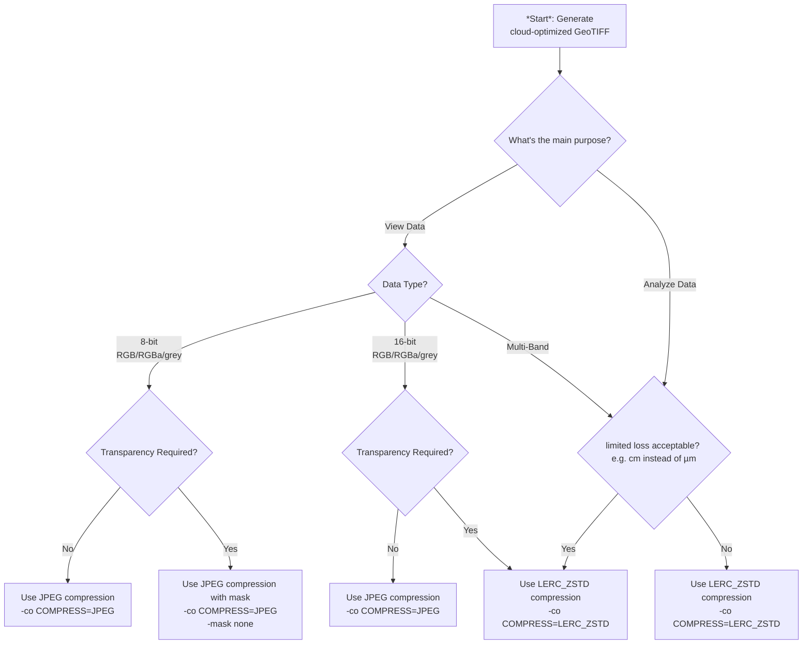

# About
This document summarizes **best practice on publishing cloud optimized data to BGDI**

# Decision tree



# Raster
Apply the optimization steps according to the use case and publish cloud-optimized GeoTIFF [COG](https://cogeo.org) using a recent version of [gdal](https://gdal.org). Windows users may use the OSGeo4WShell provided by [QGIS](https://qgis.org).

## lossless raster

Apply optimization steps for raster data
1. prepare input data at a reasonable precision (i.e. `cm` instead of `µm` or `nm` i.e. in the data source)
2. compress your data using
```
gdal_translate -a_srs EPSG:2056 -of COG -co COMPRESS=LERC_ZSTD -co LEVEL=22 -co NUM_THREADS=ALL_CPUS -co BIGTIFF=YES -co STATISTICS=YES ... -ot <datatype> <input.tif> <output.tif>
```
while
- choosing the appropriate scale and offset for the data if feasible (i.e. scale `cm` instead of `m` using [-a_scale](https://gdal.org/en/stable/programs/gdal_translate.html#cmdoption-gdal_translate-a_scale)) and / or offset (using [-a_offset](https://gdal.org/en/stable/programs/gdal_translate.html#cmdoption-gdal_translate-a_offset)) to better fit the numbers
  - rescaling the data on the fly if not preprocessed already using [-scale](https://gdal.org/en/stable/programs/gdal_translate.html#cmdoption-gdal_translate-scale)
- choosing to the most appropriate data type ([Byte/Int8/Int16/UInt16/UInt32/Int32/Float32](https://gdal.org/en/stable/programs/gdal_translate.html#cmdoption-gdal_translate-ot)) using the least amount of bits possible.

_Notes on `LERC_ZSTD` (lossy/lossless) compression:_
- _`MAX_Z_ERROR` defaults to `0` (lossless)_
- _supported since [GDAL](https://gdal.org) v2.4+_ thus also in QGIS, etc.
- _supported by [geotiff.js](https://geotiffjs.github.io/) v2.1+_ thus also in openlayers, etc.
- _has been [developed and published by ESRI](https://github.com/esri/lerc/) and is supported in their products_
- _supported in STAC-browser v3.4_

## lossy visual image

1. compress your data using
```
gdal_translate -a_srs EPSG:2056 -of COG -co COMPRESS=JPEG -co NUM_THREADS=ALL_CPUS -co BIGTIFF=YES -co STATISTICS=YES -co QUALITY=70 ... <input.tif> <output.tif>
```

## lossy numerical raster

1. compress your data using
```
gdal_translate -a_srs EPSG:2056 -of COG -co COMPRESS=LERC_ZSTD -co LEVEL=22 -co NUM_THREADS=ALL_CPUS -co BIGTIFF=YES -co STATISTICS=YES -co MAX_Z_ERROR=<threshold> ... -ot <datatype> <input.tif> <output.tif>
```
while
- choosing a threshold (limited error tolerance i.e. `0.01` for `cm`) for better lossy compression ratio


# Vector
Apply the optimization steps following the use case and publish vector data using a recent version of [ogr](https://gdal.org). Windows users may use the OSGeo4WShell provided by [QGIS](https://qgis.org).

## GeoPackage
[GeoPackage](https://www.geopackage.org) often provides better compression and can be streamed.

```
ogr2ogr -f GPKG output.gpkg input.shp
```
optionally: alter layername
```
ogrinfo output.gpkg -sql "ALTER TABLE layer_name RENAME TO new_layer_name"
```


## GeoParquet (can be provided additionally)
[GeoParquet](https://geoparquet.org) often provides better compression and can be streamed.

```
ogr2ogr -f parquet -lco COMPRESSION=ZSTD -lco GEOMETRY_ENCODING=GEOARROW -lco SORT_BY_BBOX=YES output.parquet input.shp
```
as of GDAL v3.12 `-lco COMPRESSION_LEVEL=22` may be added for effective `ZSTD` compression. (see https://github.com/OSGeo/gdal/pull/12647)

to further optimize parquet for streaming and improved compression
```python
import geopandas as gpd
gpd.read_parquet('input.parquet').to_parquet('output.parquet', compression="zstd", geometry_encoding="geoarrow", schema_version="1.1.0", compression_level=22, row_group_size=16384)
```
note: geoarrow is only supported in recent versions of GDAL 3.9+


# Point Cloud
Apply the optimization steps and publish cloud-optimized PointCloud [COPC](https://copc.io) using a recent version of [pdal](https://pdal.io). Windows users may use the OSGeo4WShell provided by [QGIS](https://qgis.org).

```
pdal translate --writer writers.copc input.las output.copc.laz
```

_Notes on COPC.LAZ_
-_Supported in QGIS through [pdal](https://pdal.io)_
-_Supported in [Potree](https://potree.org)_
-_Supported in [STAC-browser](https://radiantearth.github.io/stac-browser/) v3.4_
